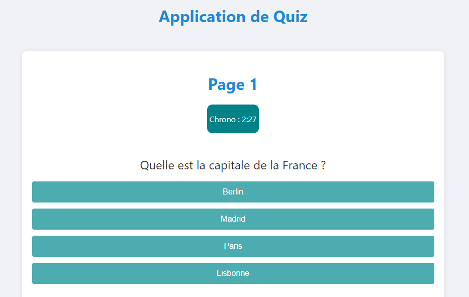
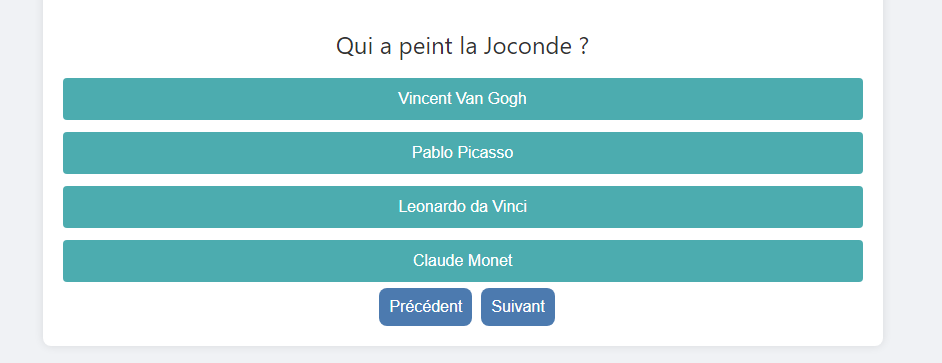
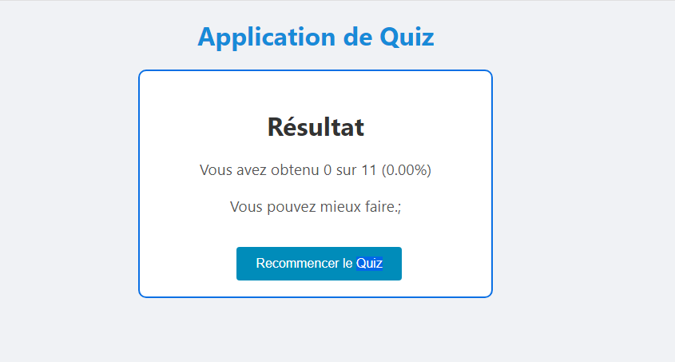

# Quiz App with Timed Navigation

This project is a React-based Quiz Application featuring a timer that navigates directly to the end if users don’t complete all questions in time. Designed for educational and challenge purposes, this app includes multiple questions, organized across multiple pages, with the ability to display several questions per page.

## Features

- Timed Quiz Flow: Each quiz session includes a timer that counts down, moving the user to the end screen if not all questions are completed.
- Multiple Questions Per Page: Supports a layout where multiple questions appear on each page, enabling a more immersive experience.
- Automatic Navigation on Timeout: If the user doesn’t answer all questions within the allocated time, the quiz ends, showing the final results or summary.
- React Component Structure: The app is modular, built using reusable components to manage questions, pages, and the timer seamlessly.

# Getting Started

## Prerequisites

Node.js and npm installed on your machine.

## Installation
### 1. **Clone the Repository:**

git clone https://github.com/laroche237/quiz-react-app.git
cd quiz-app-timer

### 2. **Install Dependencies:**

npm install

### 3. **Run the App:**

npm start

This will start the app on localhost:3000 in your default browser.

## Project Structure

src/components/Question.js: Contains logic for displaying questions per page and handling responses.

src/components/Quiz.js:  Manages the answer change, the navigation and the results.

src/Component/Chronos.js : Manages the countdown timer and triggers navigation to the results screen on timeout. 

src/Component/Option.js : Manage the options of the questions.

src/App.js: Sets up the main structure.

src/data/questions.js : Lists the questions and the answers.

### Building for Production

To create an optimized production build:

bash
npm run build

or
bash
yarn build

This will create a `build/` directory with the optimized static files.

## Usage

1. Start the Quiz: Users can start the quiz, and the timer will immediately begin counting down.

2. Answer Questions: Navigate through pages of questions, each containing multiple questions.

3. Timed Completion: If time runs out before completion, the quiz automatically redirects to the results page.

## Screenshots

  
 
 

## Tech Stack

- **React** - A JavaScript library for building user interfaces.
- **CSS3** - For styling and layout.
- **React Hooks** - For state management and lifecycle methods.
- **JavaScript ES6+** - Modern JavaScript features.

## Contributing

Contributions are welcome! If you would like to contribute to this project, feel free to open an issue or submit a pull request. Please ensure your changes are well-documented and tested.

## License

This project is licensed under the MIT License 

## Contact

For any questions or feedback, feel free to reach out:

- Email: [nyabengrlle@gmail.com](mailto:nyabengrlle@gmail.com)
- GitHub: [laroche237](https://github.com/laroche237)